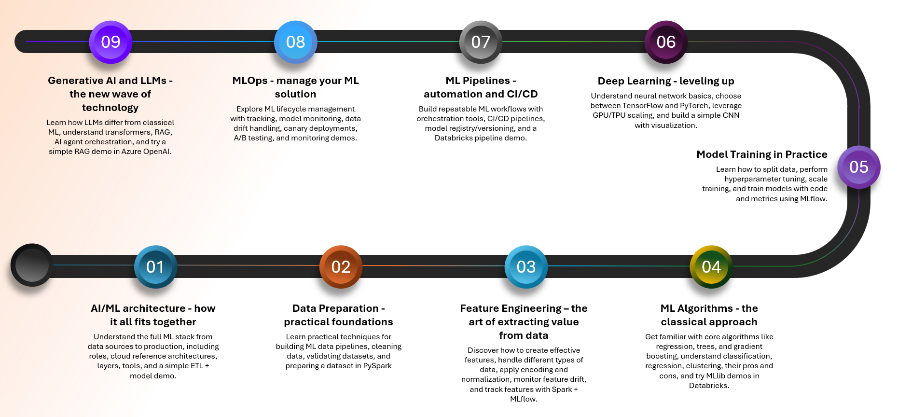

# AI/ML in practice - from theory to deployment
A series of nine technical sessions guiding participants step by step through the entire process of creating and deploying machine learning models – from data preparation, through training and MLOps, to leveraging generative AI. Each session combines practical knowledge, code, and real-world examples. The goal of the series is to build a solid understanding of how to effectively design, implement, and maintain ML solutions in production environments.

# Roadmap

| # | Topic | Meeting Goal | Agenda / Technical Details |
|---|--------|---------------|-----------------------------|
| 1 | [**AI/ML Architecture - How It All Fits Together**](https://github.com/maciejkepa/ai-ml-in-practice/tree/master/1_ai_ml_architecture) | Understand the full ML stack from data to production. | • Overview of roles and processes: Data Engineer vs Data Scientist vs MLOps • Reference ML architecture in the cloud (Azure / GCP / AWS) • Data layer, model layer, deployment layer • Tools: Databricks, MLflow, Azure ML, Airflow • **Demo:** simple ETL + model pipeline |
| 2 | [**Data and Preparation - Practical Foundations**](https://github.com/maciejkepa/ai-ml-in-practice/tree/master/2_data_preparations) | Learn data preparation techniques for ML models. | • What a data pipeline looks like in ML • Data cleaning in PySpark • Data validation with Great Expectations • **Demo:** preparing a dataset in PySpark |
| 3 | [**Feature Engineering - The Art of Extracting Value from Data**](https://github.com/maciejkepa/ai-ml-in-practice/tree/master/3_feature_engineering) | Create high-quality features and avoid pitfalls. | • Feature types: numerical, categorical, temporal, textual • One-hot encoding, embeddings • What is a Feature Store and why it matters • Normalization, standardization • Feature drift and monitoring • **Demo:** building features in Spark + MLflow tracking |
| 4 | **ML Algorithms - The Classic Approach** | Learn key ML algorithms and when to use them. | • Linear regression, decision trees, gradient boosting • Classification vs regression vs clustering • Pros and cons of various algorithms • **Demo:** MLlib in Databricks (XGBoost / LightGBM) |
| 5 | **Model Training in Practice** | Learn the model training process with code and metrics. | • Data splits (train/test/validation) • Hyperparameter tuning (grid search, random search, hyperopt) • Performance: single-node vs distributed training • **Demo:** training and tuning with MLflow |
| 6 | **Deep Learning - Stepping Up the Game** | Understand DL concepts and implementation frameworks. | • Basics of neural networks: layers, activations, backpropagation • Frameworks: TensorFlow vs PyTorch • GPU, TPU, and cloud scaling • **Demo:** simple CNN in TensorFlow + visualization |
| 7 | **ML Pipelines - Automation and CI/CD** | Build a repeatable ML workflow. | • Orchestration: Airflow, Databricks Jobs • CI/CD for ML (GitHub Actions, Azure DevOps) • Model registry and versioning (MLflow, Azure ML) • **Demo:** pipeline in Databricks |
| 8 | **MLOps - Manage Your ML Solution** | Get a full view of the ML lifecycle in production. | • MLflow tracking and registry in practice • Model monitoring and data drift • Canary deployments and A/B testing • **Demo:** model monitoring in Databricks + Azure Monitor |
| 9 | **Generative AI and LLMs - The New Wave of Technology** | Understand how LLMs reshape ML architecture. | • How LLMs differ from classical ML • Transformer architecture – high level • RAG (Retrieval-Augmented Generation) • AI Agents and orchestration (LangChain, Semantic Kernel) • **Demo:** simple RAG in Azure OpenAI |

# Setup

Before starting the workshop, complete the steps below to prepare your Databricks environment.

### 1. Create a Databricks Free Edition account
Go to:  
https://www.databricks.com/learn/free-edition  
Sign up and finish the onboarding process.

### 2. Open your Databricks workspace
Once logged in, navigate to your workspace.  
In the **Home** folder, click **Create → Git folder**.

### 3. Connect the workshop repository
When prompted:

- **Git provider:** GitHub  
- **Repository URL:** https://github.com/maciejkepa/ai-ml-in-practice

This will clone the workshop materials directly into your workspace.

